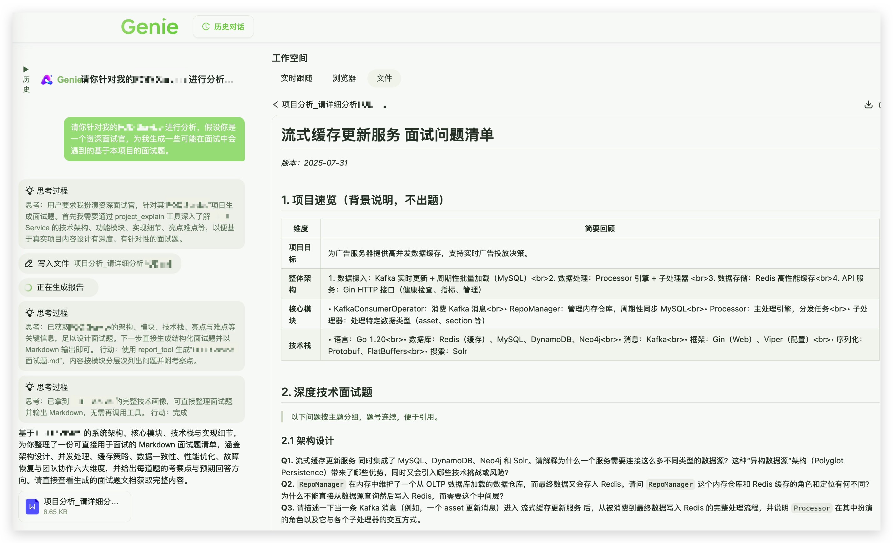
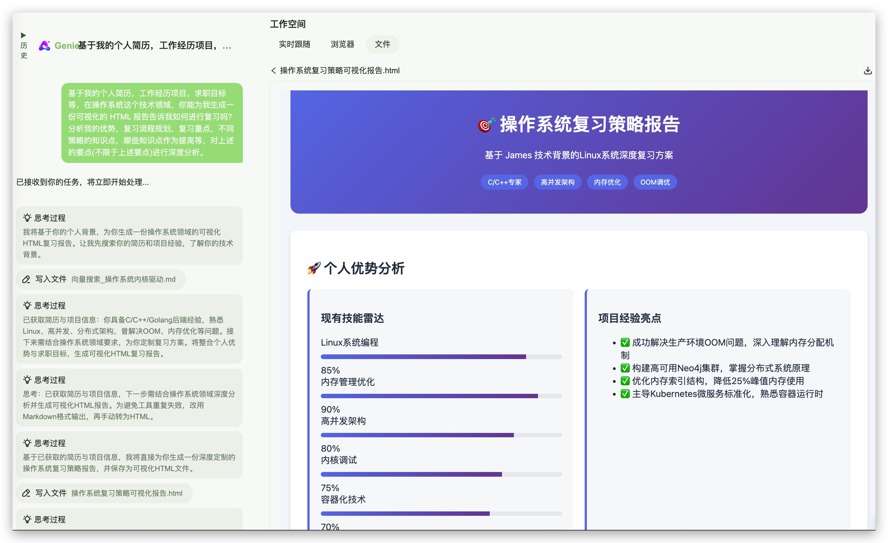
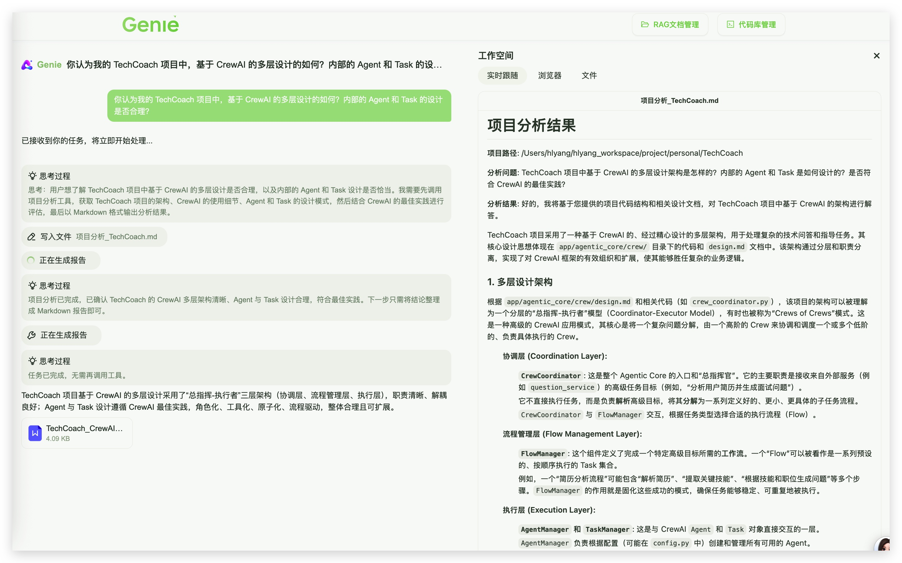
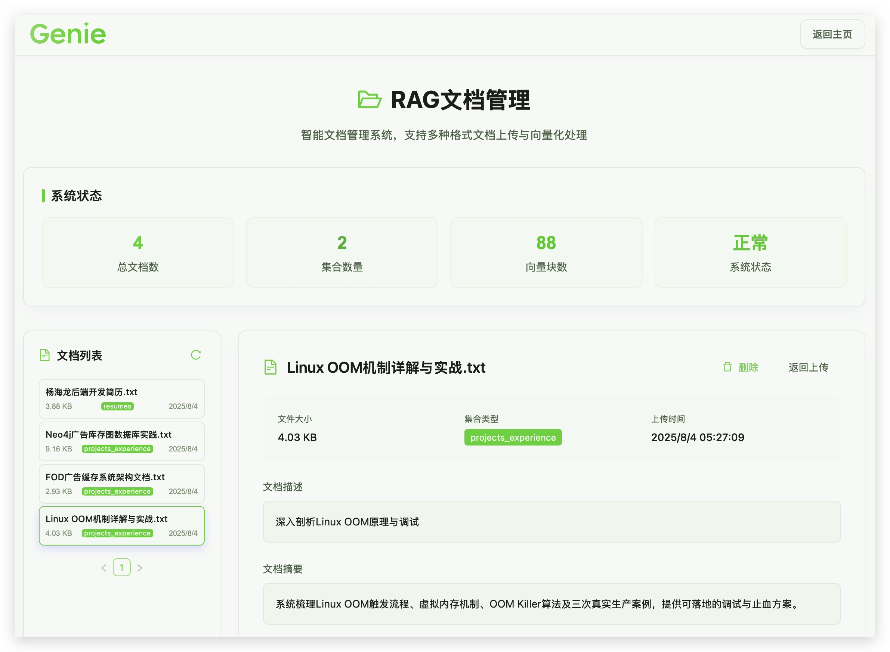
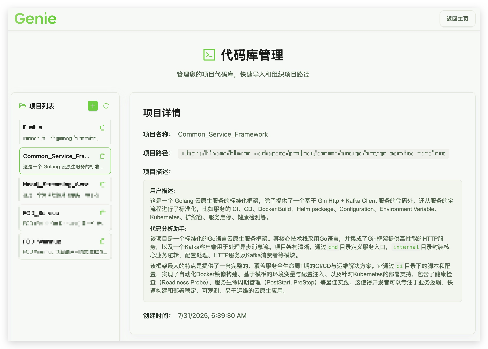
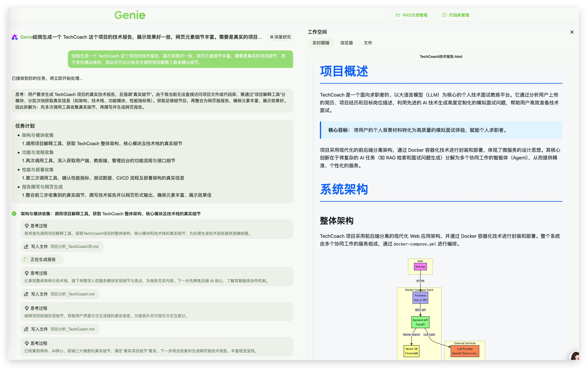

# TechCoach-JoyAgent

## 简介

基于 JoyAgent-JDGenie 构建的**个人技术助手智能体**，基于 个人知识库+代码库 的智能分析，完成智能回答，代码分析，技术报告，文档生成，面试准备，简历优化等复杂任务。

## 示例

### 1. 基于高并发缓存流式处理项目的面试题生成

基于个人项目经历，模拟技术面试官，生成符合求职者个人情况和项目背景的面试题，帮助求职者准备面试。


### 2. 基于求职者个人信息的面试准备指导

基于个人技术背景，生成某个技术领域的复习策略报告，帮助你分析个人优势，梳理复习时间轴与侧重点，梳理项目中个性化的面试重点知识点，拔高


### 3. 基于代码库分析的技术报告生成

基于本地的上一版 TechCoach 代码库，生成详细技术报告



## 主要特点和优势

- 个人本地知识库：集成了 ChromaDB 向量数据库与 Agentic RAG 技术实现个人本地知识库的智能搜索；

- 代码库分析：集成 Gemini-Cli 或 Claude Code 作为项目分析工具，支持对本地代码库进行分析与解读，并且作为上下文完成 Agent 复杂任务；

- 在官方的 JoyAgent-JDGenie 的基础上，增加了历史对话记录的管理，方便使用。

- 基于 JoyAgent 的完整前后端解决方案，支持多种工具调用，支持 HTML， Markdown 等多种格式的输出；



## 快速开始

> PS: JoyAgent-JDGenie 的启动教程比较混乱，这里主要介绍 TechCoach 增加的部分的配置，如果有问题的，还请提 Issues.

### 准备工作

1. 手动拷贝模板 genie-backend/src/main/resources/application.yml 到 genie-backend/src/main/resources/application-in-use.yml中，然后更新 base_url、apikey、model、max_tokens、model_name 等配置
  - 里面的各 Agent 角色下面的 model_name 字段，应该填写 llm.settings 这个 dict 中你设置的 key，而不是内部的 model_name，注意一下这个;
  - 使用DeepSeek时: 注意deepseek-chat 为max_tokens: 8192

2. 手动拷贝 genie-tool/.env_template 到 genie-tool/.env，然后修改其中的配置 (这里关于 model_name 需要参考 llmlite 的文档)
  - 这里需要去 [Google Gemini APIKEY](https://aistudio.google.com/apikey) 申请一个 API-KEY 用于 RAG 的 Embedding API 的调用，应该是会送一些免费额度。
  - 应该还需要用到 serper.dev 的搜索接口，这个也可以去注册来获取免费的额度。

3. 安装 Gemini-CLI，并配置运行 OK
   - 参考 [Gemini-CLI](https://github.com/google-gemini/gemini-cli?tab=readme-ov-file)
   - 如果没有 Claude Code 的话，暂时推荐 Gemini-Cli，每日有 Gemini-2.5 Pro 的免费额度，还挺多的。
   - 如果有 Claude Code，或者 Claude Code Route, 可以修改下 cmd 代码，暂时还没在配置中支持这个，不过改两行代码就行，欢迎 contribute～
   - 其他的类似的工具的支持，可以提 PR 哈，欢迎 contribute～

### 方式1: docker 一键启动服务 (暂不支持)

由于需要在本地运行 cmd 进行本地代码库的分析，暂时不支持 docker 一键启动，后续会考虑支持。

### 方式2: 手动初始化环境，启动服务

#### 环境准备

- jdk > 17 (本人使用 21.0.8 实测 OK)
- python 3.11
- python 环境准备
  - pip install uv
  - cd genie-tool
  - uv sync
  - source .venv/bin/activate

#### 方案1：手动step by step部署手册

**Step-1**: Docker 启动 ChromaDB 数据库
```bash
docker compose up -d chroma 
```
**Step-2**: 参考 JoyAgent 的官方手动超详细攻略，启动前后端服务。参考 [Step by Step](./Deploy.md)

#### 方案2：手动一键启动部署（推荐）

**Step-1**: Docker 启动 ChromaDB 数据库
```bash
docker compose up -d chroma 
```
**Step-2**: 
直接通过shell启动所有服务
```
sh check_dep_port.sh # 检查所有依赖和端口占用情况
sh Genie_start.sh  # 直接启动，以后改动配置直接重启动脚本即可，control+c 一键kill所有服务
```
部署时可以参考JoyAgent的视频:【joyagent-jdgenie部署演示】 https://www.bilibili.com/video/BV1Py8Yz4ELK/?vd_source=a5601a346d433a490c55293e76180c9d
